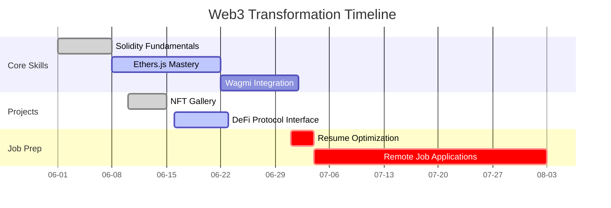

<!--
 * @Description: 
 * @Author: Luna Run
 * @Date: 2025-06-03 16:24:56
 * @LastEditTime: 2025-06-04 15:51:16
 * @LastEditors: Luna Run
-->
# 🌐 Web3 Journey | Luna

**Mission**：Become a Web3 Developer in 100 days → [Resume](resume_link)(to be updated)

**Background**: 6-Year Frontend Expert · MSc Software Engineering @ University of Malaya 

**Tech Stack**：  
  
  
  
  

## 📂  Repository Structure
| Directory | Description |
| ------ | ---- |
| **labs/** | Solidity/Hardhat experiments |
| **projects/** | Production-grade DApps |
| **docs/** | Knowledge base & notes |
| **logs/** | Learning progress |

## ⚡  Quick Start
```bash
git clone https://github.com/lunarun/Web3-Journey.git
cd web3-journey

pnpm install

# run test (have installed)
pnpm hardhat test
```

## 🛠️ Project Showcase
| Project Name | Tech Stack | Demo Link | Status |
|--------------|------------|-----------|--------|
|              |            |           |        |

## 📬 Recent Progress
- 2025-05-30: Completed 01 Hello Web3 Contract & Notes
- 2025-06-03: Completed 02 & 03 Value Types & Function Contract & Notes

## 100-Day Roadmap



## 📚 Course Code
- [01_HelloWeb3.sol](https://gist.github.com/lunarun/dd5729a5d3eb59a8beeb39e23b080e0c)  
- [02_ValueTypes.sol](contracts/ValueTypes.sol)  

## 📝 Study Notes
- [01-HelloWeb3.md](notes/01-HelloWeb3.md)
- [02-Value Types.md](notes/02-Value-Types.md)

## 📅 Learning Logs
- [2025-05-28：WTF-Solidity-Lesson 1 & 2](daily-logs/2025-05-28-WTF-Solidity-Lesson1-2.md)

## 🤝 Support Me
- **Star this repository**：Motivate me to keep updating!
- **Provide feedback**：Submit suggestions or questions in [Issues](https://github.com/lunarun/Web3-Journey/issues)
